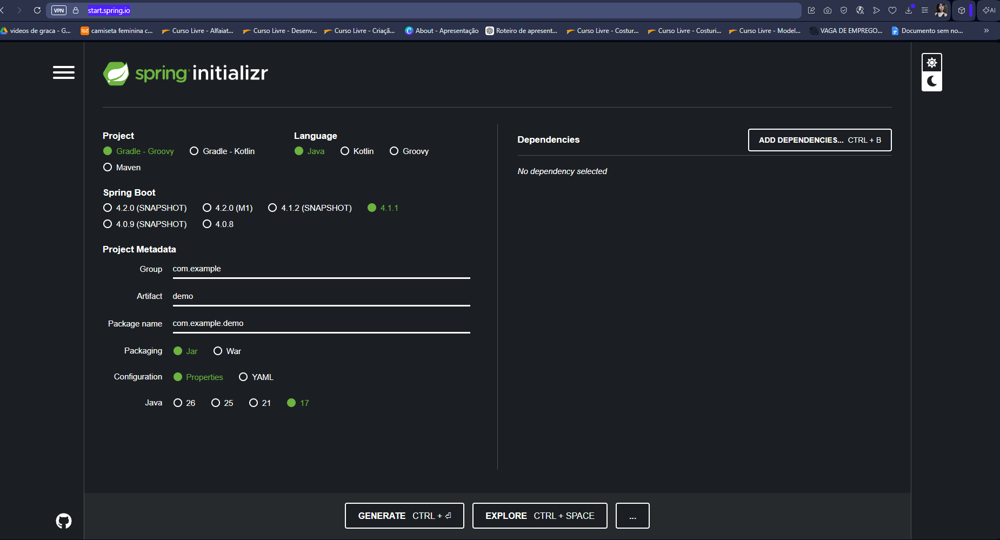
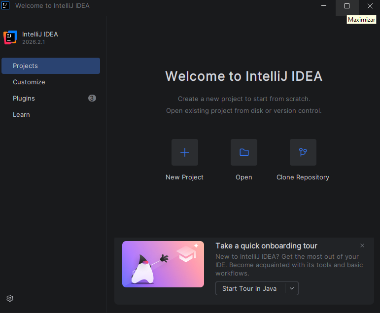
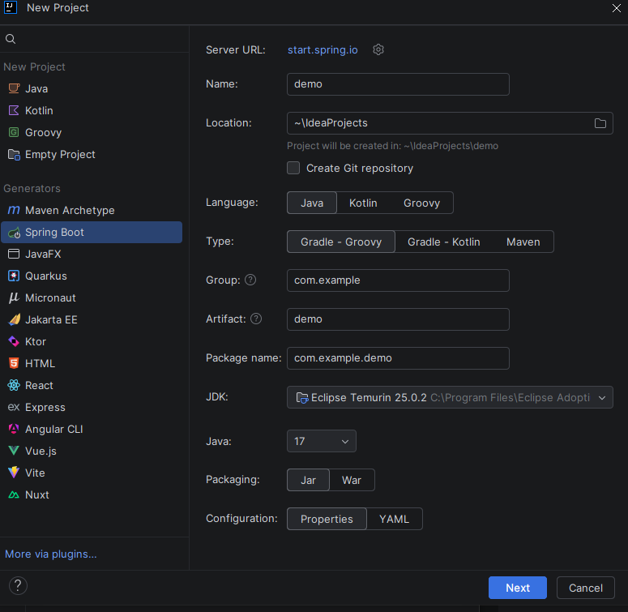
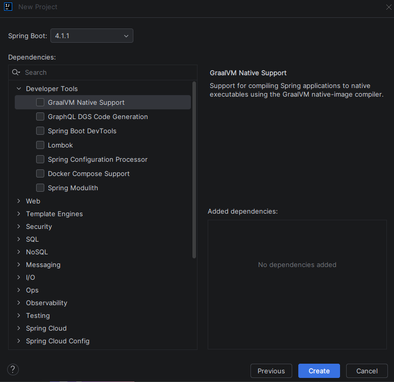

# Desenvolvimento de Software I
Aulas de Desenvolvimento de Software I com o professor João Siles utilizando Java.

# JAVA
Java é uma linguagem de programação usada para criação de apps, sistemas, jogos e muitos outros. Foi criado pela Oracle !

# Como configurar o Java no PC?
Primeiro, é bom introduzir o que é JDK, JVM e JRE (embora esse ainda não tenha sido mencionado na aula)
O JDK é Java Development Kit, ele (como o nome diz) é o kit de desenvolvimento Java, que compila o código fonte .java em bytecode .class;

(bytecode é um formato de código intermediário.)

 O JVM é o Java Virtual Machine, a máquina virtual do java que consegue executar o bytecode .class;

O JRE, que ainda não foi mencionado em aula, é o Java Runtime, ele fornece as bibliotecas padrões do java pro development kit compilar o código e permitindo a máquina virtual executar o programa.

Tendo em vista essas funcionalidades, para configurar o java na máquina, baixamos o JDK da Adoptium, marca-se a opção de baixar para todos na máquina, e também todas as opções do JDK com Hotspot (path, .jar...). Então clicar em baixar e prontinho !!
## Explicando um pouco nosso primeiro código

O nosso primeiro código foi bem simples, apenas um 'hello word' (mas que quase nao rodou ...)

" package  aula01;

public  class  Main { //o nome do arquivo deve ser o mesmo nome da classe principal TEM QUE SER COM LETRA MAIUSCULA

// a classe principal vai abracar tudo do projeto

public  static  void  main(String[] args) { //recebendo parametros

System.out.println("Hello World"); // ação, de saida

}

}

  

//todo comando e ação tem que terminar com ; "
- ele está sem indentação e com meus comentários, o que ajuda a entender um pouco melhor o que cada coisa significa, mesmo assim, vou destrinchar mais a fundo abaixo:
- package aula01 é o a forma de localizar a pasta onde meu código está! (obviamente, pra que funcione, o nome precisa ser igual o da pasta);
- Java é sensível a CAPS !;
- public  class  Main { toda linha de código precisa estar dentro de uma classe (class), e por conta da sensibilidade a caps, o nome da classe deve começar com a letra maiúscula (Main);
- O nome do arquivo do java necessariamente precisa ser identico ao nome da classe, então, meu arquivo está salvo como Main.java para que ele seja executável e funcione!
- public  static  void  main(String[] args) o código colocado dentro do main() vai ser executado, e está recebendo parâmetros. 
- System.out.println("Hello World"); aqui é um metodo de imprimir uma linha de texto, é uma ação.

## coisas a adicionar
PS C:\Users\CAMARGO\Desktop\dsi-lhorrany-cerqueira> cd .\aula01\
PS C:\Users\CAMARGO\Desktop\dsi-lhorrany-cerqueira\aula01> javac Main.Java
error: Class names, 'Main.Java', are only accepted if annotation processing is explicitly requested
1 error
PS C:\Users\CAMARGO\Desktop\dsi-lhorrany-cerqueira\aula01> javac Main.java
PS C:\Users\CAMARGO\Desktop\dsi-lhorrany-cerqueira\aula01> java Main.java
Hello World
PS C:\Users\CAMARGO\Desktop\dsi-lhorrany-cerqueira\aula01> 

jpnoctis

## variavel aula02
nao primitivo = String (COMEÇA COM MAIUSCULA!)
primitivo = todo o resto, boolean, int.. (COM MINUSCULA)

## anotações 13/04

- == igual
- === estritamente igual
- => ou <= maior igual ou menor igual
- || ou
- && e
- byte = menos espaço
- short = um pouco mais que o byte
- int e long(termina com L) = numeros maiores e INTEIROS
- floating - float(ATRIBUIR COM F) e double(TERMINA COM D) = numeros decimais ou cientificos
- 1bit = menor parcela - 8bits eh 1byte
- cientifico float f1 = 35e3f = 35000.00
- precisao matematica do float eh melhor

## anotações dia 27/04

pra transformar
double myDouble = 9.78d;
int myInt = 

so = eh atribução - conjunto matematicos
focar em otimização de código
|= eh tipo left join binario
&= eh tipo o inner join binario

## anotações 04/05

==! existe omaigod oposto do ===
int age = 18;
System.out.println(age >= 18); 
operadores logicos !!!!!!!!!!
- && logical and
- || logical or
- ! logical not
else nao existe sem if
=== nao funciona em java

## anotacoes
switch, for, do/while, break

## exercicio dnv
dentro da aula 6 
exemplos de comparações e misturando mais umas coisitas - conteudo de hoje com comentarios !

## exercicio pra casa 
https://www.w3schools.com/java/java_operators_assign.asp
explicar o que cada operador dessa pagina faz usando comentarios no codigo

## Link das fontes que usei para complementar a pesquisa !

https://dicasdeprogramacao.com.br/qual-a-diferenca-entre-jdk-jre-e-jvm/ Acesso em: 15 de março de 2026.

https://www.w3schools.com/java/java_syntax.asp Acesso em: 15 de março de 2026.
Menção honrosa à explicação do professor e aos comentários do meu código!

//ao haru ride

## anotações dia 15/06

pesquisar como fecha scanner
pesquisar sobre return em caso de if
tratamento de opções e dados

## exercicio 10/08
documentar como fazer projeto, colocar4 fotos, passo a passo, print
- sprintg. initializr
- dicionario: maven. spring, framework
- caderno como anotação
## 24/08
mudar o nome de greeting
lista json
tutorial da aula https://spring.io/guides/gs/rest-service
---
# JAVA: SpringBoot, Maven e Framework
- Recomendação: Baixar a IDE *Intellij !*
## O que é Springboot e Framework?

### O Springboot é um Framework de Java, mas o que é Framework??
- Framework é, segundo a AWS, uma coleção de componentes de software que podem ser usados novamente para deixar mais eficiente o desenvolvimento de novos softwares. é como uma ferramenta para otimizar tempo.
### E por que usar o Spring?
- Ele é popular, de código aberto e de viável para nível corporativo e executado na JVM, com sua autoconfiguração, abordagem opinativa para configuração e capcidade de criar aplicações indepentes, o Spring Framework simplica o dedsenvolvimento. Além disso, há também a funcionalidade de injeção de dependencia que permite que os objetos defina, suas proprias dependencias, proporcionando aos desenvolvedores facilidade na criação de aplicações.
___
## Como baixar o SpringBoot?
- Há duas formas: pela Web ou pela própria IDE !
### Baixando pela Web...
- Acesse o site [Spring Initializr](https://start.spring.io)
- No Initializr, haverá várias opções para criar o seu projeto !

- Destrinchando as opções temos:
- O **project**, que define a ferramente que vai gerenciar as depedencias e compilar o projeto. O maven usa o arquivo pom.xml, ou seja, xml, para configuração, é o mais tradicional. O Gradle - Groovy/Kotlin usa build.gradle ou .kts. é mais moderna e sintaxe é menor. Joao siles recomenda o maven !
-  **Java**, **Groovy** e **Kotlin** são linguagens de programação, tem que selecionar a linguagem certa para o project certo.
- SpringBoot vai definir a versão da aplicação que será usada: as *snapshot* são versões mais instaveis, assim como as M1, M2 *(milestones)*; os *números normais* mesmo são versões estáveis e mais recomendadas, a não ser que você precise de um recurso super especifico das versões em desenvolvimento!
- O Project Metadata é mais complexo ! o  **Group** define o pacote raiz do java; o **Artifact** é o nome do projeto em si; **Name** é quase igual ao artifact, serve de nome de exibição; **Description** como o nome disse, é uma descrição do projeto; **Package** vai ser onde o código-fonte do pacote java principal será organizado, é gerado automaticamente pelo group + artifact mas dá pra trocar.
- **Packaging** vai definir o formato final do arquivo compilar o projeto. O *Jar* gera um arquivo executável com servidor embutido, e é o padrão hoje em dia; o *War* gera um arquivo que precisará ser implantado em um servidor de aplicação externo, é mais usado em ambientes corporativos legados.
- **Configuration** define o formato da aplicação; O *Properties* tem o formato application.properties, com pares chave=valor, e é mais simples; o *YAML* é o formato application.yaml, usa indentação e é mais legível para configurações complexas.
- O **Java** vai definir a versão do JDK. O prof prefere a 21 porque a 25 e 26 são muuito recentes e a 17 é bem jurassica. a 21 é o equilibrio perfeito .
- **Dependencies** são as dependencias que o projeto vai usar, nós utilizamos o Spring Web, o Spring Dev Tools e mais dois que eu esqueci ! adiciopnar depois quando lembrar... Mas tem inumeras funcionalidades e integrações disponíveis!
- Aí é so clicar em generate, vai baixar o arquivo zip e você abre na IDE que você preferir! (LEMBRANDO Q VSCODE EH EDITOR DE TEXTO)
---
### Usando o Spring direto na IDE
- Abrindo o InteliJ...

- Na tela inicial, clique no new project.

- Clicando na opção de Spring Boot, as opções são as quase as mesmas da Web, com a diferença que você pode escolher seu JDK ! O meu é o da eclipse, mas na escola usamos o Amazon Corretto. 

- Essa é a tela de dependencias no intelij
- Clicando em next, o projeto é criado e já abre na sua IDE !!

### Fontes pra complementar pesquisa alem das aulas
- [AWS](https://aws.amazon.com/pt/what-is/framework/)
- [IBM](https://www.ibm.com/br-pt/think/topics/java-spring-boot)